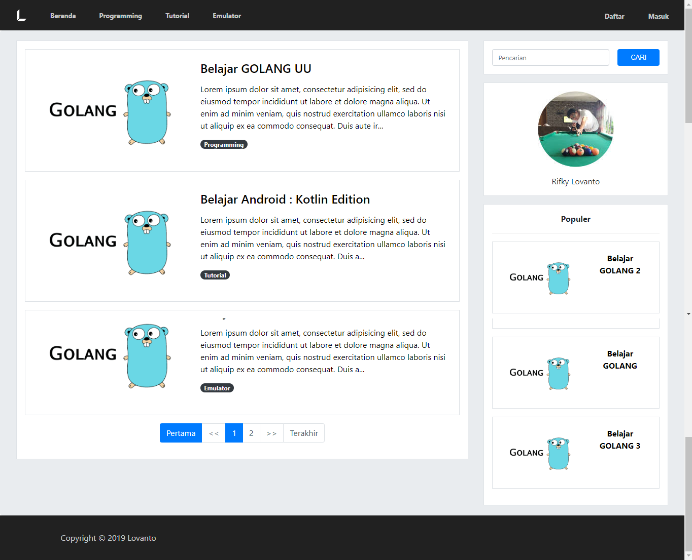
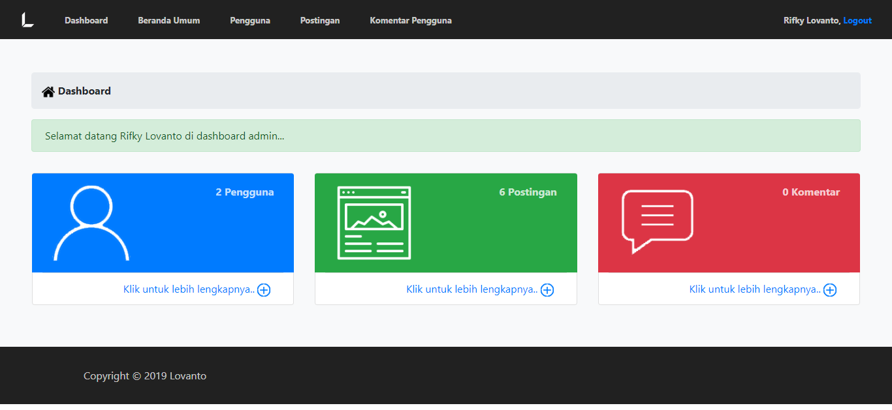
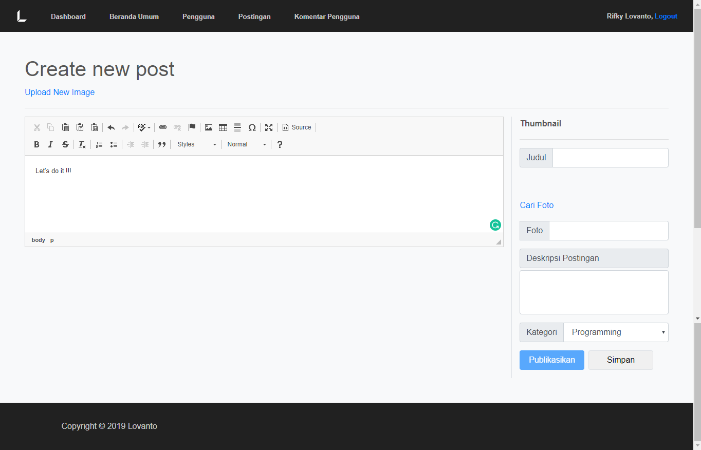

# Personal Blog

## Description
Like in the description, this repo just my simple personal blog. This one using php 7 for backend, cloudinary for handle image, and ckeditor-4 for handle WYSIWYG post. This personal blog have three access type anonim, user, and admin.

# User Access
1. Anonim
When anonim u can read all post but u can't comment or ask on the blog.

2. User
How to get the user account ?
Just access the register page then, login the account.
When u login as user u can comment on post.

3. Admin
Admin can do all user can do and also can manage blog like create post. For using admin page u can create your own account in **phpmyadmin** or you can use this account
> Username : lovanto
> Password : lovanto123

## How To Run
 1. Download this repo or clone this repo using `git clone https://github.com/lovanto/personalBlog.git`
 2. Move this repo to your localhost dir(xampp, appserv, etc.)
 3. Open cmd and use this command `composer update`
 4. Import file **personalBlog.sql** to your phpmyadmin
 5. And then open it on browser [click here](http://localhost/personalBlog) if still default setting

## Notes
Use this program as a reference not for plagiarism.